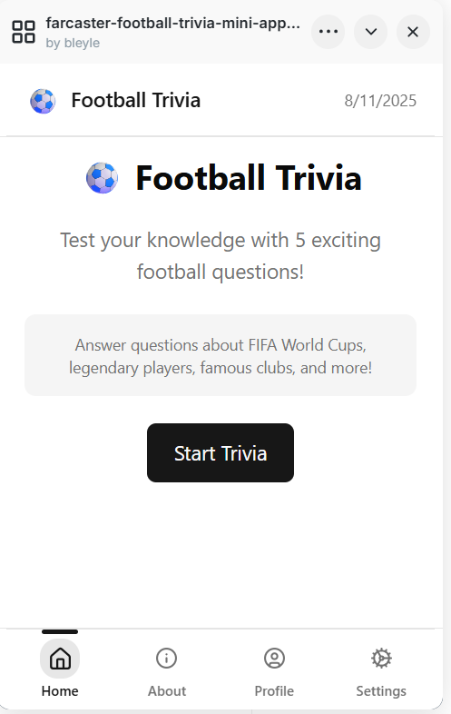
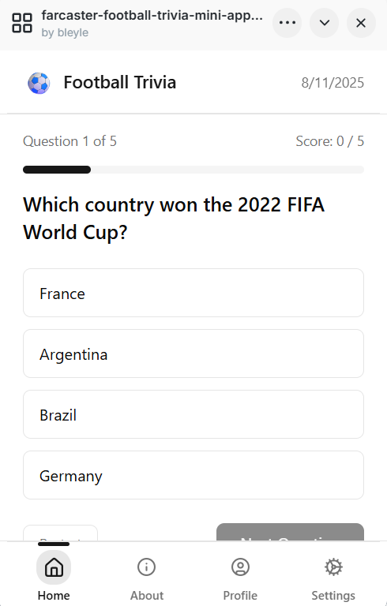
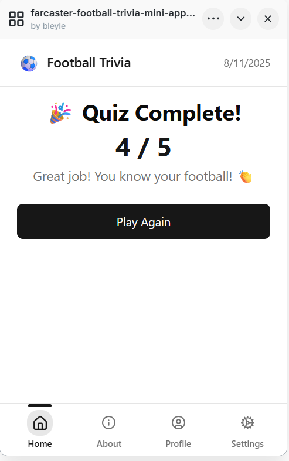

# ⚽ Football Trivia Mini App

A modern football trivia application built as both a Farcaster Mini App and Progressive Web App (PWA). Test your football knowledge with quick-fire questions covering leagues, history, players, and records.

## 🌟 Features

- **Dual Platform Support**: Works as both a Farcaster Mini App and standalone PWA
- **Interactive Trivia**: Multiple-choice questions with instant feedback
- **Score Tracking**: Keep track of your performance across sessions
- **Modern UI**: Clean, responsive design with smooth animations
- **Offline Ready**: PWA capabilities for offline usage
- **Mobile Optimized**: Perfect for mobile devices with proper safe area handling

## 🚀 Live Demo

- **PWA Version**: [Your PWA URL]
- **Farcaster Mini App**: Available in the Farcaster ecosystem

## 📱 Screenshots

<div align="center">
  
  
  
</div>

## 🛠️ Tech Stack

- **Framework**: [Next.js 15](https://nextjs.org/) with App Router
- **Language**: [TypeScript](https://www.typescriptlang.org/)
- **Styling**: [Tailwind CSS 4](https://tailwindcss.com/)
- **UI Components**: [Radix UI](https://www.radix-ui.com/) + Custom components
- **Farcaster Integration**: [@farcaster/frame-sdk](https://docs.farcaster.xyz/)
- **Theme**: [next-themes](https://github.com/pacocoursey/next-themes) for dark/light mode
- **Icons**: [Lucide React](https://lucide.dev/)

## 🎮 How to Play

1. **Start the Game**: Click "Start Trivia" from the home screen
2. **Answer Questions**: Select from multiple-choice options
3. **Get Instant Feedback**: See correct answers immediately after selection
4. **Track Your Score**: Monitor your progress throughout the quiz
5. **Complete & Replay**: View final results and play again to improve

## 🏗️ Project Structure

```
src/
├── app/
│   ├── farcaster/          # Farcaster Mini App routes
│   │   ├── components/     # Farcaster-specific components
│   │   ├── trivia/         # Trivia game page
│   │   └── layout.tsx      # Farcaster app layout
│   ├── pwa/               # PWA routes
│   │   ├── components/     # PWA-specific components
│   │   └── layout.tsx      # PWA app layout
│   └── manifest.ts         # PWA manifest configuration
├── components/
│   └── ui/                # Reusable UI components
├── lib/
│   ├── constants.ts       # App constants
│   └── utils.ts          # Utility functions
├── providers/            # React context providers
└── styles/              # Global styles
```

## 🚀 Getting Started

### Prerequisites

- Node.js 18+ or Bun
- npm, yarn, pnpm, or bun

### Installation

1. **Clone the repository**
   ```bash
   git clone https://github.com/yourusername/farcaster-football-trivia-mini-app.git
   cd farcaster-football-trivia-mini-app
   ```

2. **Install dependencies**
   ```bash
   npm install
   # or
   bun install
   ```

3. **Set up environment variables**
   ```bash
   cp .env.example .env.local
   ```
   Configure your environment variables in `.env.local`

4. **Run the development server**
   ```bash
   npm run dev
   # or
   bun dev
   ```

5. **Open your browser**
   - PWA: [http://localhost:3000/pwa](http://localhost:3000/pwa)
   - Farcaster: [http://localhost:3000/farcaster](http://localhost:3000/farcaster)

## 📝 Available Scripts

- `npm run dev` - Start development server with Turbo
- `npm run build` - Build for production
- `npm run start` - Start production server
- `npm run preview` - Build and preview production locally
- `npm run lint` - Run ESLint
- `npm run lint:fix` - Fix ESLint issues
- `npm run format:check` - Check code formatting
- `npm run format:write` - Format code with Prettier
- `npm run typecheck` - Run TypeScript type checking
- `npm run check` - Run all checks (lint + typecheck)

## 🎨 Customization

### Adding New Questions

Edit the `QUESTIONS` array in `src/app/farcaster/trivia/page.tsx`:

```typescript
const QUESTIONS: TriviaQuestion[] = [
  {
    question: "Your question here?",
    options: ["Option A", "Option B", "Option C", "Option D"],
    answerIndex: 0, // Index of correct answer (0-based)
  },
  // Add more questions...
];
```

### Theming

The app supports both light and dark modes. Customize colors in:
- `src/styles/globals.css` - CSS custom properties
- `tailwind.config.js` - Tailwind theme configuration

### Farcaster Configuration

Update Farcaster-specific settings in `src/app/farcaster-manifest.ts`:
- App name and description
- Account association details
- Screenshots and images
- Categories and tags

## 🌍 Deployment

### Vercel (Recommended)

1. Push your code to GitHub
2. Connect your repository to [Vercel](https://vercel.com)
3. Deploy with default settings

### Other Platforms

The app can be deployed to any platform that supports Next.js:
- Netlify
- Railway
- DigitalOcean App Platform
- AWS Amplify

## 🤝 Contributing

Contributions are welcome! Please feel free to submit a Pull Request.

1. Fork the project
2. Create your feature branch (`git checkout -b feature/AmazingFeature`)
3. Commit your changes (`git commit -m 'Add some AmazingFeature'`)
4. Push to the branch (`git push origin feature/AmazingFeature`)
5. Open a Pull Request

## 📄 License

This project is licensed under the MIT License - see the [LICENSE](LICENSE) file for details.

## 🙏 Acknowledgments

- Built with the [Farcaster Mini App and PWA Template](https://github.com/gaiaslabs/template)
- UI components inspired by [shadcn/ui](https://ui.shadcn.com/)
- Football trivia questions curated for educational purposes

## 📞 Support

If you have any questions or need help with the project:

- Open an [issue](https://github.com/yourusername/farcaster-football-trivia-mini-app/issues)
- Join our community discussions
- Check out the [Farcaster documentation](https://docs.farcaster.xyz/)

---

Made with ⚽ and ❤️ for football fans everywhere!